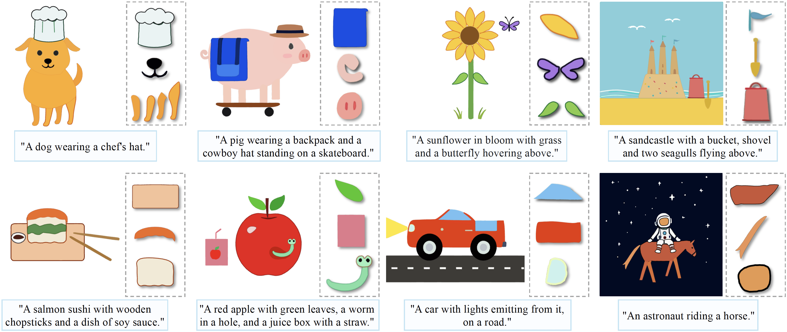

# Chat2SVG: Vector Graphics Generation with Large Language Models and Image Diffusion Models

[](https://arxiv.org/abs/2411.16602)
[](https://chat2svg.github.io/)



## Overview

Chat2SVG is a framework for generating vector graphics using large language models and image diffusion models. The system works in multiple stages to generate, enhance, and optimize SVG from text descriptions.


## TODO List
- [x] SVG template generation with Large Language Models
- [ ] Detail enhancement with image diffusion models
- [ ] SVG shape optimization


## Setup
Clone the repository:
```shell
git clone git@github.com:kingnobro/Chat2SVG.git
cd Chat2SVG
```

Create a new conda environment:
```shell
conda create --name chat2svg python=3.10
conda activate chat2svg
```

Install PyTorch and other dependencies:
```shell
conda install pytorch==1.13.1 torchvision==0.14.1 torchaudio==0.13.1 pytorch-cuda=11.6 -c pytorch -c nvidia
pip install -r requirements.txt
```

Install [diffvg](https://github.com/BachiLi/diffvg) for differentiable rendering:
```shell
git clone https://github.com/BachiLi/diffvg.git
cd diffvg
git submodule update --init --recursive
conda install -y -c anaconda cmake
conda install -y -c conda-forge ffmpeg
pip install svgwrite svgpathtools cssutils torch-tools
python setup.py install
cd ..
```

Install [picosvg](https://github.com/googlefonts/picosvg) for SVG cleaning:
```shell
git clone git@github.com:googlefonts/picosvg.git
cd picosvg
pip install -e .
cd ..
```

## Pipeline 🖌

### Stage 1: Template Generation

First, paste your Anthropic API key into the `.env` file:
```shell
API_KEY=<your_key>
```

Then, run the following command to generate SVG templates:
```shell
cd 1_template_generation
bash run.sh
```
In `run.sh`, the detailed prompts of each target object can be found in `utils/util.py`.

> [!CAUTION]
> Hong Kong is banned by Anthropic/OpenAI. Therefore, I use a third-party API from [WildCard](https://bewildcard.com/) (not recommended, since they cannot provide receipts) to forward requests to Claude. If you are in a region where you can access Anthropic/OpenAI directly, you can modify lines 64-65 in `utils/gpt.py` to use the original Anthropic API. Additional modifications may be required. Sorry for the inconvenience.

### Stage 2: Detail Enhancement
This stage enhances the initial SVG templates with additional visual details using image diffusion models. Code coming soon.

### Stage 3: SVG Shape Optimization
The final stage optimizes the SVG shapes for improved visual quality. Code coming soon.